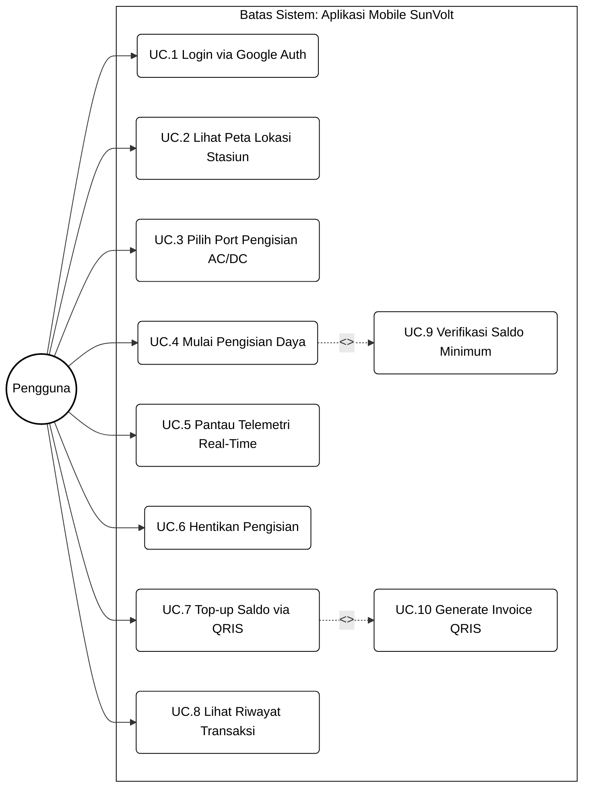
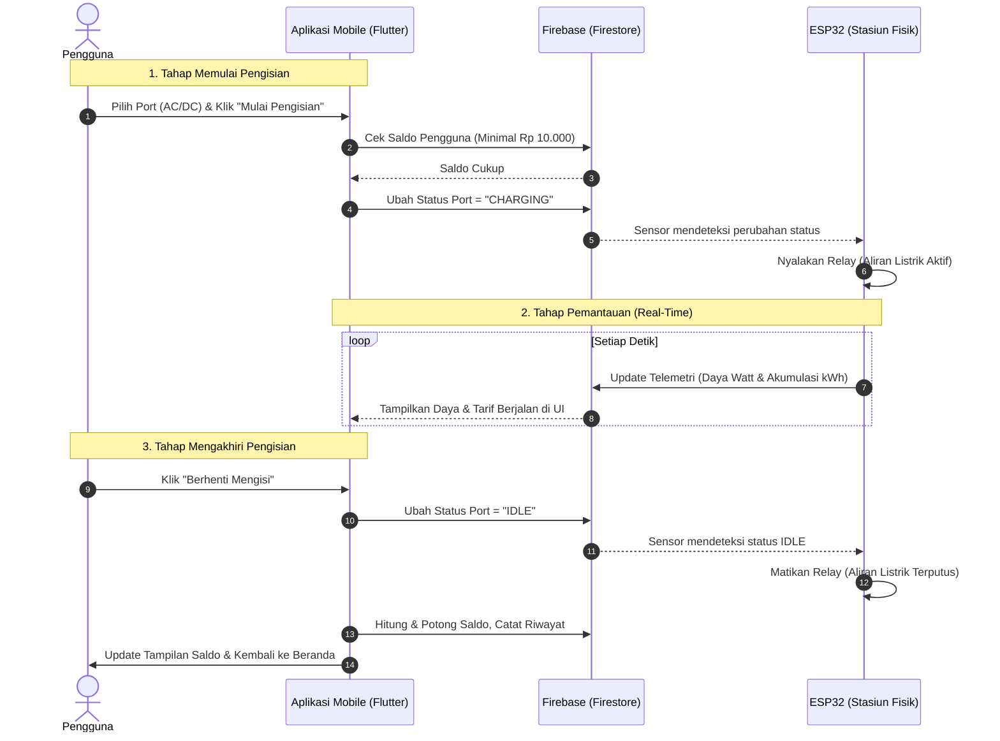
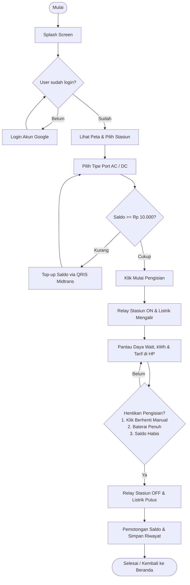

# BAB III
# DESAIN RANCANGAN SOLUSI

## 3.1 Alternatif Usulan Solusi
Penyelesaian permasalahan yang dihadapi dalam perancangan stasiun pengisian daya Kendaraan Listrik Ringan (LEV) ini memerlukan integrasi yang kuat antara infrastruktur kelistrikan (perangkat keras) dan sistem informasi pemantauan (perangkat lunak). Oleh karena itu, alternatif solusi dibagi menjadi dua kelompok terpisah, yaitu alternatif solusi perangkat keras dan alternatif solusi perangkat lunak.

### 3.1.1 Alternatif Usulan Solusi Perangkat Keras
Dalam perancangan infrastruktur kelistrikan dan pemanenan energi stasiun pengisian daya LEV, dirumuskan tiga alternatif konfigurasi perangkat keras. Perbandingan parameter dan spesifikasi teknis dari ketiga alternatif solusi tersebut disajikan pada Tabel 3.1.

**Tabel 3.1 Analisis Alternatif Solusi Perangkat Keras**

| Parameter Komponen | Solusi 1: Sistem On-Grid | Solusi 2: Sistem Hybrid | Solusi 3: Sistem Off-Grid (Solusi Terpilih) |
| :--- | :--- | :--- | :--- |
| **Deskripsi Sistem** | Sistem yang terhubung langsung ke jaringan PLN tanpa menggunakan baterai penyimpanan. Daya surya langsung dikonversi ke beban. | Sistem yang terhubung ke jaringan PLN dan dilengkapi dengan baterai penyimpanan cadangan energi. | Sistem mandiri yang tidak terhubung ke PLN dan wajib menggunakan baterai untuk menyimpan energi secara penuh. |
| **Penyimpanan Energi** | Tanpa baterai penyimpanan. Energi matahari yang berlebih diekspor ke jaringan PLN. | Menggunakan bank baterai sebagai penyimpan energi primer sebelum didukung PLN. | Wajib menggunakan bank baterai untuk menyimpan seluruh energi yang dipanen panel surya. |
| **Keandalan Sistem** | Mati secara otomatis saat jaringan PLN padam demi keselamatan kelistrikan (*anti-islanding*). | Tetap menyala saat PLN padam dengan memanfaatkan daya baterai sebagai cadangan darurat. | Mandiri dan terus beroperasi selama daya baterai stasiun masih mencukupi. |
| **Kesesuaian Lokasi** | Cocok untuk daerah perkotaan yang memiliki jaringan listrik PLN stabil tanpa mati lampu. | Sangat ideal untuk area dengan pasokan listrik yang sering padam namun masih terjangkau PLN. | Ideal untuk daerah terpencil yang belum terjangkau jaringan listrik utama atau kluster kampus luas. |
| **Konsep Power Stage** | Grid-tied inverter yang menyinkronkan fase frekuensi dengan jala-jala listrik PLN. | Inverter hybrid yang mengatur aliran daya panel surya, baterai, dan backup jala-jala PLN. | *DC-DC Boost Converter* (54.6V 20A) untuk sepeda listrik, dan *Inverter Pure Sine Wave* (1000W 220V AC) untuk motor. |
| **Otak & Kontrol** | Mikrokontroler pembaca telemetri grid saja tanpa pengaturan relay pengisian. | Mikrokontroler dengan logika ATS (Automatic Transfer Switch) untuk perpindahan solar ke PLN. | ESP32-U WROOM mengendalikan pengisian, membaca sensor INA219 via I2C, dan mengontrol dual relay. |
| **Kelebihan** | Biaya instalasi lebih murah karena tanpa baterai, dapat mengekspor daya berlebih ke PLN. | Keandalan daya sangat tinggi, memiliki pasokan ganda (solar, baterai, dan PLN). | Kemandirian energi 100%, ramah lingkungan, tidak terpengaruh pemadaman listrik jala-jala PLN. |
| **Kekurangan** | Sistem tidak dapat beroperasi saat terjadi pemadaman listrik PLN di lingkungan kampus. | Biaya instalasi dan kompleksitas pengkabelan sistem kelistrikan sangat tinggi. | Bergantung sepenuhnya pada cuaca matahari dan memerlukan kapasitas bank baterai yang besar. |

---

### 3.1.2 Alternatif Usulan Solusi Perangkat Lunak
Untuk mempermudah pemilihan teknologi perangkat lunak stasiun pengisian daya LEV SunVolt, perbandingan alternatif solusi dilakukan secara terpisah untuk komponen *framework* aplikasi mobile, sistem database, *payment gateway*, dan platform *deployment* backend. Analisisnya disajikan pada Tabel 3.2.

**Tabel 3.2 Analisis Alternatif Solusi Perangkat Lunak**

| Komponen Perangkat Lunak | Alternatif 1 | Alternatif 2 | Alternatif 3 (Solusi Terpilih) |
| :--- | :--- | :--- | :--- |
| **Framework Mobile** | **Kotlin (Native Android)**.<br>Kompilasi native khusus Android, performa tinggi, namun tidak mendukung iOS. | **React Native (JavaScript)**.<br>Framework cross-platform, ekosistem luas, namun performa rendering sedikit lebih berat. | **Flutter (Dart - SunVolt)**.<br>Kompilasi native cross-platform, rendering visual kustom bertema *"Solar Kinetic"* sangat halus. |
| **Sistem Database** | **Supabase (PostgreSQL)**.<br>Database relasional dengan fitur real-time bawaan, namun struktur data kurang fleksibel. | **MySQL**.<br>Database relasional konvensional, sangat stabil untuk transaksi, namun tidak mendukung real-time secara native. | **Firebase (Cloud Firestore & RTDB)**.<br>Database hybrid NoSQL, sinkronisasi telemetri real-time dengan latensi sangat rendah (< 200 ms). |
| **Payment Gateway** | **Xendit**.<br>Mendukung berbagai metode e-wallet lokal, namun dokumentasi SDK Flutter kurang terintegrasi. | **Doku**.<br>Pemain payment gateway senior di Indonesia, namun fitur pengujian sandbox tergolong terbatas. | **Midtrans**.<br>Fitur pengujian simulator sandbox QRIS sangat matang dan memiliki SDK resmi Flutter yang stabil. |
| **Deployment Backend** | **Render**.<br>Platform cloud paas gratis/murah, namun proses spin-up awal server cukup lambat. | **Railway**.<br>Platform cloud yang andal dengan sistem billing terukur, namun batas free tier tergolong kecil. | **Vercel Serverless**.<br>Deployment serverless Node.js/Express dengan uptime sangat tinggi dan CD terintegrasi Git. |

---

### 3.1.3 Sistem Penilaian Usulan Solusi (Scoring System)
Untuk menentukan alternatif solusi terbaik secara objektif dan kuantitatif, digunakan metode penilaian kuantitatif (*scoring system*) menggunakan Skala Likert 1–10 dengan ketentuan interval sebagai berikut:
* **Skor 1–2 : Sangat tidak sesuai** (Tidak memenuhi standar, biaya sangat mahal, atau fitur tidak aman).
* **Skor 3–4 : Tidak sesuai** (Kurang memadai dari segi fitur atau keselamatan).
* **Skor 5–6 : Cukup sesuai** (Standar rata-rata, fungsionalitas dasar terpenuhi).
* **Skor 7–8 : Sesuai** (Memenuhi kriteria rancangan dengan baik).
* **Skor 9–10 : Sangat sesuai** (Sangat memuaskan, efisien, aman, dan fitur lengkap).

Nilai akhir dari masing-masing alternatif solusi dihitung dalam bentuk persentase kesesuaian keseluruhan menggunakan Persamaan (3.2):
$$\text{Persentase Kesesuaian (\%)} = \frac{\text{Skor Total}}{\text{Skor Maksimum}} \times 100\%$$ (3.2)
Dimana Skor Total diperoleh dari penjumlahan seluruh nilai parameter kriteria rekayasa, dan Skor Maksimum dihitung dari jumlah parameter dikali nilai tertinggi (skor 10).

---

## 3.2 Analisis dan Pemilihan Solusi
Proses analisis dan penilaian dilakukan secara terpisah untuk sistem perangkat keras dan perangkat lunak guna menentukan kombinasi teknologi terbaik berdasarkan skala skoring 1-10 dan rumus persentase kesesuaian.

### 3.2.1 Analisis Solusi Perangkat Keras
Penilaian kelayakan terhadap alternatif perangkat keras dibagi menjadi empat keputusan pemilihan komponen utama, yaitu sistem sumber energi kelistrikan, pemilihan mikrokontroler, pemilihan sensor kelistrikan, dan pemilihan konfigurasi penyimpanan daya (baterai).

#### 1. Pemilihan Sistem Sumber Energi Kelistrikan
Perbandingan kelayakan sistem energi disajikan pada Tabel 3.3. (Skor Maksimum = 40).

**Tabel 3.3 Penilaian Pemilihan Sistem Sumber Energi Kelistrikan**

| Kriteria Penilaian | Solusi 1: On-Grid | Solusi 2: Hybrid | Solusi 3: Off-Grid (Terpilih) |
| :--- | :---: | :---: | :---: |
| Kemandirian Energi (Bebas PLN) | 2 | 8 | 10 |
| Efisiensi Biaya Operasional | 3 | 7 | 10 |
| Keandalan Suplai Daya stasiun | 9 | 10 | 7 |
| Kesesuaian Konsep Green Campus | 2 | 8 | 10 |
| **Skor Total** | **16 / 40** | **33 / 40** | **37 / 40** |
| **Persentase Kesesuaian (%)** | **40,00%** | **82,50%** | **92,50%** |

*Keputusan:* **Solusi 3: Off-Grid** terpilih karena menghasilkan tingkat kesesuaian tertinggi sebesar **92,50%** (Sangat Sesuai), mendukung pencapaian emisi nol lokal di lingkungan kampus secara penuh tanpa ketergantungan kelistrikan PLN.

#### 2. Pemilihan Mikrokontroler
Perbandingan spesifikasi mikrokontroler stasiun disajikan pada Tabel 3.4. (Skor Maksimum = 40).

**Tabel 3.4 Penilaian Pemilihan Mikrokontroler**

| Kriteria Penilaian | Arduino Nano 33 IoT | STM32L4 + WiFi | ESP32-U WROOM (Terpilih) |
| :--- | :---: | :---: | :---: |
| Kemampuan Komputasi (Clock/SRAM) | 4 | 7 | 10 |
| Kemudahan Integrasi Sensor (I2C/SPI) | 6 | 8 | 10 |
| Keandalan Komunikasi Wi-Fi On-Chip | 7 | 5 | 10 |
| Efisiensi Biaya Komponen | 3 | 6 | 9 |
| **Skor Total** | **20 / 40** | **26 / 40** | **39 / 40** |
| **Persentase Kesesuaian (%)** | **50,00%** | **65,00%** | **97,50%** |

*Keputusan:* **ESP32-U WROOM** terpilih dengan skor **97,50%** karena performa prosesor dual-core yang sangat responsif, modul Wi-Fi terintegrasi yang andal, serta harga komponen yang sangat terjangkau bagi mahasiswa.

#### 3. Pemilihan Sensor Kelistrikan
Perbandingan jenis sensor untuk akuisisi data arus, tegangan, dan daya disajikan pada Tabel 3.5. (Skor Maksimum = 30).

**Tabel 3.5 Penilaian Pemilihan Sensor Kelistrikan**

| Kriteria Penilaian | Sensor ACS712 | Sensor PZEM-004T | Sensor INA219 (Terpilih) |
| :--- | :---: | :---: | :---: |
| Akurasi & Resolusi Telemetri | 4 | 7 | 10 |
| Kemudahan Integrasi Bus I2C | 8 | 5 | 10 |
| Kekebalan terhadap Induksi Derau (*Noise*) | 2 | 8 | 9 |
| **Skor Total** | **14 / 30** | **20 / 30** | **29 / 30** |
| **Persentase Kesesuaian (%)** | **46,67%** | **66,67%** | **96,67%** |

*Keputusan:* **Sensor INA219** terpilih dengan skor **96,67%** karena mentransmisikan data telemetri kelistrikan dalam bentuk digital via bus I2C dengan resolusi tinggi dan bebas derau dibanding ACS712 analog.

#### 4. Pemilihan Konfigurasi Penyimpanan Daya (Baterai)
Perbandingan jenis bank baterai stasiun disajikan pada Tabel 3.6. (Skor Maksimum = 40).

**Tabel 3.6 Penilaian Pemilihan Konfigurasi Penyimpanan Daya (Baterai)**

| Kriteria Penilaian | Aki Mobil Bekas/Rekondisi | Baterai LiFePO4 Battery Pack | Aki VRLA Deep Cycle Baru (Terpilih) |
| :--- | :---: | :---: | :---: |
| Umur Pakai (Cycle Life) | 2 | 10 | 6 |
| Densitas Energi & Berat | 2 | 10 | 5 |
| Kestabilan Tegangan Kerja | 4 | 10 | 8 |
| Efisiensi Biaya Pengadaan | 10 | 3 | 9 |
| **Skor Total** | **18 / 40** | **33 / 40** | **28 / 40** |
| **Persentase Kesesuaian (%)** | **45,00%** | **82,50%** | **70,00%** |

*Keputusan:* **Aki VRLA Deep Cycle (Baru) 12V 12Ah** terpilih (skor **70,00%** - Sesuai). Meskipun LiFePO4 memiliki umur pakai terbaik, harganya yang sangat tinggi tidak efisien untuk anggaran Tugas Akhir. Aki VRLA Deep Cycle memberikan keseimbangan terbaik antara harga pengadaan dan kestabilan tegangan kerja sistem off-grid 48V.

---

### 3.2.2 Analisis Solusi Perangkat Lunak
Penilaian kelayakan terhadap alternatif solusi perangkat lunak dibagi menjadi empat keputusan pemilihan komponen utama, yaitu framework mobile, sistem database, payment gateway, dan platform deployment backend.

#### 3.2.2.1 Pemilihan Framework Aplikasi Mobile
Perbandingan framework untuk aplikasi mobile SunVolt disajikan pada Tabel 3.7. (Skor Maksimum = 30).

**Tabel 3.7 Penilaian Pemilihan Framework Mobile**

| Kriteria Penilaian | Native Android (Kotlin) | React Native (JavaScript) | Flutter (Dart - Terpilih) |
| :--- | :---: | :---: | :---: |
| Efisiensi Pengkodean Cross-Platform | 2 | 9 | 10 |
| Performa Rendering UI | 10 | 6 | 9 |
| Kemudahan Integrasi Firebase SDK | 8 | 8 | 10 |
| **Skor Total** | **20 / 30** | **23 / 30** | **29 / 30** |
| **Persentase Kesesuaian (%)** | **66,67%** | **76,67%** | **96,67%** |

*Keputusan:* **Flutter (Dart)** terpilih dengan skor **96,67%** (Sangat Sesuai) karena kemampuannya menghasilkan aplikasi Android dan iOS dari satu codebase dengan performa rendering grafis yang sangat halus.

#### 3.2.2.2 Pemilihan Sistem Database
Perbandingan sistem database disajikan pada Tabel 3.8. (Skor Maksimum = 30).

**Tabel 3.8 Penilaian Pemilihan Sistem Database**

| Kriteria Penilaian | Relational Database (MySQL) | Supabase (PostgreSQL) | Firebase (Cloud Firestore - Terpilih) |
| :--- | :---: | :---: | :---: |
| Sinkronisasi Data Real-Time | 2 | 8 | 10 |
| Fleksibilitas Skema NoSQL | 4 | 8 | 10 |
| Kemudahan Integrasi IoT (ESP32) | 4 | 6 | 10 |
| **Skor Total** | **10 / 30** | **22 / 30** | **30 / 30** |
| **Persentase Kesesuaian (%)** | **33,33%** | **73,33%** | **100,00%** |

*Keputusan:* **Firebase Cloud Firestore** terpilih secara mutlak dengan skor **100,00%** (Sangat Sesuai) karena integrasi instan dengan mikrokontroler dan sinkronisasi real-time berbasis WebSockets.

#### 3.2.2.3 Pemilihan Payment Gateway
Perbandingan payment gateway disajikan pada Tabel 3.9. (Skor Maksimum = 30).

**Tabel 3.9 Penilaian Pemilihan Payment Gateway**

| Kriteria Penilaian | Doku | Xendit | Midtrans (Terpilih) |
| :--- | :---: | :---: | :---: |
| Kelengkapan Fitur Sandbox Uji Coba | 6 | 8 | 10 |
| Kualitas Dokumentasi & SDK Flutter | 4 | 8 | 10 |
| Kemudahan Integrasi QRIS | 6 | 8 | 10 |
| **Skor Total** | **16 / 30** | **24 / 30** | **30 / 30** |
| **Persentase Kesesuaian (%)** | **53,33%** | **80,00%** | **100,00%** |

*Keputusan:* **Midtrans** terpilih secara mutlak dengan skor **100,00%** (Sangat Sesuai) karena dokumentasi SDK resmi Flutter yang sangat baik dan kemudahan simulasi pembayaran QRIS sandbox.

#### 3.2.2.4 Pemilihan Platform Deployment Backend
Perbandingan platform deploy server API Node.js disajikan pada Tabel 3.10. (Skor Maksimum = 30).

**Tabel 3.10 Penilaian Pemilihan Platform Deployment Backend**

| Kriteria Penilaian | Railway | Render | Vercel Serverless (Terpilih) |
| :--- | :---: | :---: | :---: |
| Keandalan Server (Uptime) | 8 | 8 | 10 |
| Efisiensi Biaya (Free Tier) | 6 | 8 | 10 |
| Kemudahan Deploy (Git Integration) | 8 | 8 | 10 |
| **Skor Total** | **22 / 30** | **24 / 30** | **30 / 30** |
| **Persentase Kesesuaian (%)** | **73,33%** | **80,00%** | **100,00%** |

*Keputusan:* **Vercel Serverless** terpilih secara mutlak dengan skor **100,00%** (Sangat Sesuai) karena integrasi CI/CD repositori Git yang instan dan ketersediaan batas serverless gratis yang sangat memadai.

---

## 3.3 Desain Solusi Terpilih
Desain solusi terpilih mengintegrasikan rancangan fisik perangkat keras stasiun, skematik sirkuit kelistrikan, logika kendali nirkabel (IoT), serta rancangan antarmuka pengguna pada aplikasi mobile SunVolt dan web dashboard admin.

### 3.3.1 Desain Solusi Terpilih Perangkat Keras
Desain perangkat keras terbagi menjadi struktur fisik stasiun pengisian dan rancangan sirkuit elektronik terintegrasi.
Sistem dirancang untuk melayani dual pengisian LEV secara off-grid bertenaga surya. Struktur fisik stasiun didesain sebagai *standalone shelter* terintegrasi yang terbagi menjadi tiga segmen utama:
1. **Struktur Atap dan Penyangga Panel Surya Bagian Atas:** Didesain berupa kanopi miring baja kokoh sebagai dudukan (*mounting*) 4 unit panel surya 100 Wp sekaligus melindungi unit dari panas dan hujan.
2. **Unit Kontrol Utama (Main Control Unit):** Boks panel (enclosure) tahan air yang dipasang di bawah atap pada ketinggian ergonomis. Mewadahi ESP32-U WROOM, sensor INA219, breaker, sekring, dan dual relay (AC & DC).
3. **Kabinet Penyimpanan Energi (Battery Cabinet):** Terletak pada bagian dasar stasiun sebagai kabinet tertutup pintu ganda untuk menyimpan bank baterai SLA 48V. Penempatan ini menjaga titik berat stasiun tetap rendah agar struktur stabil.

*(Mahasiswa memasukkan Gambar 3.1: Desain Stasiun Tampak Depan secara manual)*
`Gambar 3.1 Desain Stasiun Tampak Depan`

*(Mahasiswa memasukkan Gambar 3.2: Desain Stasiun Tampak Belakang secara manual)*
`Gambar 3.2 Desain Stasiun Tampak Belakang`

*(Mahasiswa memasukkan Gambar 3.3: Desain Kabinet Kelistrikan Dan Penyimpanan Energi secara manual)*
`Gambar 3.3 Desain Kabinet Kelistrikan Dan Penyimpanan Energi`

Rancangan sirkuit perangkat keras diintegrasikan menggunakan PCB kustom untuk menghindari penggunaan kabel jumper lepas-pasang yang rentan terlepas di lingkungan luar ruangan.

*(Mahasiswa memasukkan Gambar 3.4: Use Case Perangkat Keras secara manual)*
`Gambar 3.4 Use Case Perangkat Keras`

Use Case Diagram perangkat keras menggambarkan hubungan antara tiga aktor utama: Operator (menghubungkan kabel fisik), Aplikasi Mobile (mengirim sinyal kontrol/pembayaran), dan Baterai/Beban (memicu pembacaan sensor). Fungsionalitas utama mencakup deteksi baterai, terima perintah WiFi, kendali relay, dan pengamanan *safety cut-off*.

*(Mahasiswa memasukkan Gambar 3.5: Sequence Diagram Hardware secara manual)*
`Gambar 3.5 Sequence Diagram Hardware`

Sequence diagram menggambarkan urutan interaksi: Aplikasi mengirim perintah "Start" -> ESP32-U WROOM mengaktifkan relay (ON) -> Arus mengalir -> ESP32-U WROOM membaca data kelistrikan sensor INA219 secara berkala -> Jika terdeteksi kondisi bahaya (suhu/tegangan berlebih) atau baterai penuh, ESP32-U WROOM memutus relay (OFF) dan mengirim alarm ke Firebase.

*(Mahasiswa memasukkan Gambar 3.6: Diagram Activity Hardware secara manual)*
`Gambar 3.6 Diagram Activity Hardware`

Diagram aktivitas memaparkan alur algoritma firmware: Inisialisasi sistem -> Menunggu instruksi -> Validasi koneksi beban -> Relay ON -> Pengisian daya berjalan -> Pemantauan telemetri kontinu -> Auto cut-off (Normal Stop jika arus mendekati 0A, Emergency Stop jika terjadi *error*).

*(Mahasiswa memasukkan Gambar 3.7: Skematik Rangkaian Elektronik secara manual)*
`Gambar 3.7 Skematik Rangkaian Elektronik`

*(Mahasiswa memasukkan Gambar 3.8: Skema Desain PCB secara manual)*
`Gambar 3.8 Skema Desain PCB`

---

### 3.3.2 Desain Solusi Terpilih Perangkat Lunak
Sistem perangkat lunak memproses data sensor real-time dari Firebase dan memvisualisasikannya ke pengguna serta memfasilitasi kendali relay bagi admin. Perancangan perangkat lunak SunVolt mencakup aplikasi mobile untuk pengguna umum dan dasbor web admin untuk pemantauan diagnostik serta kendali jarak jauh. 

*(Mahasiswa memasukkan Gambar 3.9: Use Case Diagram Aplikasi secara manual)*


`Gambar 3.9 Use Case Diagram Aplikasi`

Gambar 3.9 merepresentasikan Use Case Diagram Aplikasi SunVolt yang disusun menggunakan standar pemodelan UML (*Unified Modeling Language*). Komponen-komponen diagram ini disesuaikan dengan simbol *use case* standar pada umumnya:
1. **Actor (Aktor):** Digambarkan dengan simbol stick figure (*Pengguna*) yang mewakili entitas luar (staf/mahasiswa) yang berinteraksi secara aktif dengan aplikasi.
2. **Use Case (Kasus Penggunaan):** Digambarkan dengan bentuk elips/oval untuk mewakili fungsionalitas atau layanan utama yang disediakan oleh sistem aplikasi mobile SunVolt (dari UC.1 hingga UC.10).
3. **Relationship (Relasi/Hubungan):**
   * **Association (Asosiasi/Arah Aksi):** Digambarkan dengan garis solid berpanah yang menghubungkan Aktor *Pengguna* ke masing-masing *use case* utama, menunjukkan bahwa aktor tersebut berpartisipasi aktif memicu kasus penggunaan yang dituju.
   * **Include Relationship (Relasi \<\<include\>\>):** Digambarkan dengan garis panah putus-putus bersimbol `<<include>>` untuk menunjukkan ketergantungan wajib di mana suatu *use case* memerlukan fungsionalitas dari *use case* lain untuk diselesaikan:
     - *UC.4 (Mulai Pengisian Daya)* memiliki hubungan `<<include>>` terhadap *UC.9 (Verifikasi Saldo Minimum)*, artinya pengisian daya hanya dapat dimulai jika sistem telah berhasil melakukan validasi saldo.
     - *UC.7 (Top-up Saldo via QRIS)* memiliki hubungan `<<include>>` terhadap *UC.10 (Generate Invoice QRIS)*, artinya setiap permintaan pengisian saldo akan selalu memicu sistem untuk membuat invoice kode pembayaran QRIS terlebih dahulu.

*(Mahasiswa memasukkan Gambar 3.10: Sequence Diagram Aplikasi secara manual)*


`Gambar 3.10 Sequence Diagram Aplikasi`

Gambar 3.10 memaparkan diagram urutan (*sequence diagram*) yang menggambarkan interaksi dinamis dan pertukaran pesan (*message exchange*) antar objek sistem sepanjang proses pengisian daya kendaraan berlangsung, yang dibagi menjadi tiga fase utama:
*   **1. Tahap Memulai Pengisian:** Dimulai saat Pengguna memilih port kelistrikan (AC/DC) dan mengetuk "Mulai Pengisian" di UI Aplikasi. Aplikasi secara asinkron melakukan kueri (*query*) ke database Firebase Firestore untuk memeriksa saldo pengguna. Jika saldo mencukupi (>= Rp 10.000), Aplikasi mengubah status dokumen port stasiun di Firestore menjadi `CHARGING`. Perubahan status ini langsung dibaca oleh mikrokontroler ESP32 melalui fungsi *listener* real-time, yang kemudian memicu aktuasi fisik berupa menyalakan relay utama stasiun agar aliran listrik mengalir ke kendaraan.
*   **2. Tahap Pemantauan (Real-Time):** Selama fase pengisian berjalan aktif, ESP32 secara periodik (setiap 1 detik) membaca data dari sensor dan mengunggah (*push*) data daya listrik (Watt) serta akumulasi energi (kWh) ke database Firestore. Firebase kemudian menyalurkan data ini ke Aplikasi Mobile secara dinamis untuk menampilkan grafik daya masuk dan perhitungan tarif berjalan yang harus dibayar pengguna di UI secara real-time.
*   **3. Tahap Mengakhiri Pengisian:** Ketika Pengguna menekan tombol "Berhenti Mengisi", Aplikasi mengubah dokumen status port di Firestore kembali menjadi `IDLE`. ESP32 mendeteksi perubahan ini dan segera mematikan relay fisik untuk memutuskan aliran listrik. Terakhir, Aplikasi menghitung total tagihan, memproses pemotongan saldo pengguna di database Firestore, mencatat riwayat transaksi, memperbarui tampilan sisa saldo dompet di aplikasi, dan mengarahkan pengguna kembali ke halaman utama (Beranda) tanpa menampilkan resi transaksi khusus.

*(Mahasiswa memasukkan Gambar 3.11: Diagram Activity Aplikasi secara manual)*


`Gambar 3.11 Diagram Activity Aplikasi`

Gambar 3.11 menunjukkan diagram aktivitas (*activity diagram*) yang memetakan alur kerja (*workflow*) logis dan keputusan transisi layar (*navigation state*) yang dialami oleh pengguna dari awal hingga akhir penggunaan aplikasi SunVolt:
*   **Alur Autentikasi:** Aplikasi dimulai dari *Splash Screen* untuk mengevaluasi token login lokal. Jika sesi tidak aktif, pengguna harus melewati aktivitas otentikasi Google Sign-In terlebih dahulu. Jika berhasil, sistem menyinkronkan data pengguna dengan database Firestore dan mengarahkan ke halaman peta utama.
*   **Alur Pemilihan Stasiun & Port:** Di peta utama, pengguna dapat melihat penanda stasiun pengisian daya terdekat. Setelah memilih stasiun, pengguna membuka layar detail dan memilih tipe sirkuit port output (AC/DC).
*   **Alur Validasi Saldo & Top-Up:** Sebelum memulai pengisian, sistem mengevaluasi apakah saldo pengguna memenuhi prasyarat minimum Rp 10.000. Jika saldo kurang, pengguna diarahkan ke menu Dompet untuk melakukan aktivitas *top-up* via QRIS Midtrans Sandbox. Jika saldo mencukupi, sirkuit pengisian diaktifkan.
*   **Alur Pengisian & Monitoring:** Setelah konfirmasi disetujui, relay stasiun fisik menyala dan listrik mengalir. Pengguna memantau parameter telemetri di layar ponsel. Aktivitas pengisian akan terus berjalan hingga salah satu kondisi pemutus terpenuhi: pengguna menekan tombol stop manual, baterai kendaraan terdeteksi penuh oleh sensor, atau saldo habis di tengah jalan. Setelah relay padam, sistem memotong saldo, mencatat riwayat log, dan memperbarui tampilan sisa saldo pada layar utama (Beranda) sebagai akhir dari sirkuit aktivitas.

*(Mahasiswa memasukkan Gambar 3.12: Desain Mockup Aplikasi Mobile SunVolt secara manual)*
`Gambar 3.12 Desain Mockup Aplikasi Mobile SunVolt`

*(Mahasiswa memasukkan Gambar 3.13: Desain Mockup Dashboard Admin Web secara manual)*
`Gambar 3.13 Desain Mockup Dashboard Admin Web`

Rancangan arsitektur dan sistem perangkat lunak SunVolt diuraikan secara lebih sederhana sebagai berikut:
1. **Pemrograman Aplikasi Mobile (Flutter/Dart):** Aplikasi dirancang menggunakan framework Flutter yang ringan dan reaktif. Alur kode program difokuskan secara terpusat untuk mengelola status antarmuka (*state management*) re-render reaktif. Struktur kode dibagi menjadi beberapa modul utama: modul autentikasi (menggunakan pustaka Google Sign-In), modul peta interaktif OSRM (untuk memetakan stasiun pengisian terdekat), modul telemetri (untuk menampilkan Watt, kWh, dan biaya pengisian berjalan), serta modul dompet digital (untuk proses pembayaran top-up).
2. **Perancangan Basis Data Reaktif (Firebase Firestore):** Database NoSQL Cloud Firestore digunakan sebagai pusat penyimpanan data real-time dengan sinkronisasi latensi rendah (< 200 ms). Struktur Firestore dirancang sederhana dengan membagi data menjadi dua koleksi utama:
   * **Koleksi Pengguna (`users`):** Mengelola profile kredensial pengguna (nama, email), nominal saldo e-wallet teraktif, serta riwayat transaksi top-up dan pengisian daya.
   * **Koleksi Stasiun (`stations`):** Menyimpan status operasional port pengisian stasiun (status `IDLE` untuk stasiun siaga, dan `CHARGING` untuk stasiun aktif) serta telemetri dinamis (Watt, kWh, dan suhu) yang diperbarui oleh mikrokontroler ESP32 setiap detik untuk dibaca secara live oleh aplikasi ponsel.
3. **Integrasi Gerbang Pembayaran (Midtrans QRIS):** Sistem pengisian saldo dompet digital diintegrasikan langsung menggunakan Snap API Midtrans. Saat pengguna meminta top-up, aplikasi memanggil layanan Snap Midtrans untuk memunculkan kode QRIS Sandbox. Setelah pembayaran disimulasikan lunas oleh pengguna pada simulator sandbox, status pembayaran dikirimkan untuk memperbarui data saldo pengguna di database Firestore secara instan.

---

### 3.3.3 Persamaan Matematika dan Kalkulasi Desain Sistem
Perhitungan analisis energi kelistrikan off-grid stasiun SunVolt dirumuskan sebagai berikut:

#### 1. Produksi Energi Surya (Solar Energy Harvesting)
Total daya nominal nominal dari susunan panel surya ($P_{pv}$) dirumuskan oleh Persamaan (3.3):
$$P_{pv} = N_{panel} \times P_{rating} \quad \text{[Watt]}$$ (3.3)
Dimana $N_{panel} = 4$ unit dan $P_{rating} = 100\text{ Wp}$. Maka didapatkan daya puncak nominal sebesar $P_{pv} = 400\text{ Wp}$.

Akumulasi produksi energi harian yang dihasilkan ($E_{pv}$) dirumuskan oleh Persamaan (3.4):
$$E_{pv} = P_{pv} \times t_{sun} \times \eta_{sys} \quad \text{[Wh/hari]}$$ (3.4)
Dengan mengasumsikan rata-rata waktu penyinaran matahari efektif di Bandung ($t_{sun} = 4\text{ jam}$) dan efisiensi konversi sistem akibat rugi-rugi kabel, debu, dan suhu ($\eta_{sys} = 80\%$ atau $0,8$), maka:
$$E_{pv} = 400\text{ Wp} \times 4\text{ jam} \times 0,8 = 1280\text{ Wh/hari}$$

#### 2. Kapasitas Penyimpanan Baterai (Battery Storage Capacity)
Bank baterai stasiun terdiri dari 4 unit baterai SLA 12 V 12 Ah yang disusun secara seri. Tegangan nominal sistem baterai ($V_{bat}$) dirumuskan oleh Persamaan (3.5):
$$V_{bat} = N_{seri} \times V_{unit} = 4 \times 12\text{ V} = 48\text{ V}$$ (3.5)
Total energi nominal yang disimpan di dalam baterai stasiun ($E_{bat}$) dirumuskan oleh Persamaan (3.6):
$$E_{bat} = V_{bat} \times C_{bat} = 48\text{ V} \times 12\text{ Ah} = 576\text{ Wh}$$ (3.6)

#### 3. Akuisisi Data Sensor Telemetri INA219
Sensor INA219 membaca tegangan beban ($V_{load}$) melalui pembacaan tegangan bus internal ($V_{bus}$) dan tegangan shunt ($V_{shunt}$) pada resistor presisi 0,1 $\Omega$ sebagaimana dinyatakan dalam Persamaan (3.7):
$$V_{load} = V_{bus} + V_{shunt} \quad \text{[Volt]}$$ (3.7)
Daya sesaat (*real-time power*) yang dikonsumsi oleh kendaraan listrik ($P_{load}$) dirumuskan oleh Persamaan (3.8):
$$P_{load} = V_{load} \times I \quad \text{[Watt]}$$ (3.8)
Dimana $I$ menyatakan arus listrik (Ampere) yang dideteksi mengalir melalui resistor shunt.

Akumulasi konsumsi energi listrik yang tersalurkan ke kendaraan ($E_{used}$) dihitung oleh ESP32-U WROOM menggunakan metode integral numerik Riemann dengan interval waktu sampling $\Delta t = 1\text{ detik}$, seperti ditunjukkan pada Persamaan (3.9):
$$E_{used} = \int_{0}^{t} P_{load}(t) \, dt \approx \sum_{i=1}^{n} P_{load, i} \times \frac{\Delta t}{3600} \quad \text{[Wh]}$$ (3.9)

#### 4. Perhitungan Tarif Dinamis Pengguna
Tarif yang harus dibayar oleh pengguna ($T_{user}$) berbanding lurus dengan energi terpakai ($E_{used}$) dikalikan konstanta tarif per Wh ($K_{tarif}$ = Rp 1,5 per Wh, setara Rp 1.500/kWh), dirumuskan oleh Persamaan (3.10):
$$T_{user} = E_{used} \times K_{tarif} \quad \text{[Rupiah]}$$ (3.10)

#### 5. Perhitungan Jalur Distribusi Output DC (Sepeda Listrik)
Beban pengisian daya sepeda listrik memerlukan arus konstan 2 A pada tegangan pengisian 54,6 V DC. Daya beban sepeda ($P_{bike}$):
$$P_{bike} = 54,6\text{ V} \times 2\text{ A} = 109,2\text{ W}$$
Dengan efisiensi konversi DC-DC Boost Converter ($\eta_{boost} = 90\%$), daya yang ditarik dari bank baterai stasiun ($P_{draw, DC}$) dihitung melalui Persamaan (3.11):
$$P_{draw, DC} = \frac{P_{bike}}{\eta_{boost}} = \frac{109,2\text{ W}}{0,90} \approx 121,3\text{ W}$$ (3.11)
Total kebutuhan energi stasiun untuk mengisi penuh satu unit baterai sepeda listrik kosong (baterai sepeda 48V 12Ah = 576 Wh) adalah:
$$E_{req, DC} = \frac{576\text{ Wh}}{0,90} = 640\text{ Wh}$$
Jika stasiun hanya mengandalkan bank baterai terisi penuh (tanpa input panel surya), persentase pengisian daya maksimal sepeda listrik yang dapat dicapai ($\%_{max}$) dirumuskan oleh Persamaan (3.12):
$$\%_{max} = \frac{E_{bat}}{E_{req, DC}} \times 100\% = \frac{576\text{ Wh}}{640\text{ Wh}} \times 100\% = 90\%$$ (3.12)
*(Persentase ini meningkat 5% dari purwarupa sebelumnya karena pengurangan rugi-rugi konversi daya baterai seri 48V).*

#### 6. Perhitungan Jalur Distribusi Output AC (Motor Listrik)
Suplai pengisian sepeda motor listrik menggunakan pengisi daya AC bawaan pabrik dengan konsumsi daya nominal $P_{motor} = 300\text{ W}$. Dengan efisiensi *Inverter Pure Sine Wave* ($\eta_{inv} = 85\%$), daya yang ditarik dari stasiun ($P_{draw, AC}$) dirumuskan oleh Persamaan (3.13):
$$P_{draw, AC} = \frac{P_{motor}}{\eta_{inv}} = \frac{300\text{ W}}{0,85} \approx 352,9\text{ W}$$ (3.13)
Durasi pengisian maksimum motor listrik ($t_{motor}$) menggunakan energi baterai stasiun murni adalah:
$$t_{motor} = \frac{E_{bat}}{P_{draw, AC}} = \frac{576\text{ Wh}}{352,9\text{ W}} \approx 1,63\text{ jam (1 jam 38 menit)}$$

---

### 3.3.4 Arsitektur Basis Data (Entity Relationship Diagram)
Database SunVolt menggunakan dua layanan Firebase, yaitu Cloud Firestore (untuk penyimpanan data persistent terstruktur) dan Realtime Database (untuk komunikasi IoT latensi rendah).

*(Mahasiswa memasukkan Gambar 3.14: Entity Relationship Diagram (ERD) Database secara manual)*
`Gambar 3.14 Entity Relationship Diagram (ERD) Database`

---

## 3.4 Jadwal dan Anggaran

### 3.4.1 Jadwal Kegiatan Pengerjaan Proyek
Pengerjaan proyek tugas akhir dirancang untuk diselesaikan dalam durasi 22 minggu (1 semester) sebagaimana dirinci pada Tabel 3.11.

**Tabel 3.11 Jadwal Kegiatan Pengerjaan Tugas Akhir**

| No | Tahapan Kegiatan | M1-M4 | M5-M8 | M9-M12 | M13-M16 | M17-M20 | M21-M22 |
| :--- | :--- | :---: | :---: | :---: | :---: | :---: | :---: |
| 1 | Riset kebutuhan pengguna dan survei lokasi stasiun pengisian. | [xxxx] | | | | | |
| 2 | Pengadaan komponen hardware (solar panel, baterai, sensor, dll). | | [xxxx] | | | | |
| 3 | Perakitan kelistrikan stasiun & pembuatan custom rangka fisik. | | [xxxx] | [xxxx] | | | |
| 4 | Pemrograman firmware ESP32 & kalibrasi sensor INA219. | | | [xxxx] | [xxxx] | | |
| 5 | Pengembangan aplikasi Flutter SunVolt & Web Admin Dashboard. | | | [xxxx] | [xxxx] | | |
| 6 | Integrasi sistem IoT (ESP32 - Cloud - Aplikasi Mobile/Web). | | | | [xxxx] | [xxxx] | |
| 7 | Pengujian fungsionalitas kelistrikan, auto cut-off, & kuesioner. | | | | | [xxxx] | |
| 8 | Evaluasi sistem, perbaikan bug, & penyusunan dokumen laporan. | | | | | | [xxxx] |

---

### 3.4.2 Rencana Anggaran Biaya (RAB)
Rincian anggaran biaya pembelian alat dan pembuatan infrastruktur untuk Sistem Pengisian Daya LEV SunVolt disajikan pada Tabel 3.12.

**Tabel 3.12 Rencana Anggaran Biaya (RAB) Pembelian Alat**

| No | Komponen Alat / Bahan | Spesifikasi Teknis | Qty | Satuan | Harga Satuan (Rp) | Total Harga (Rp) |
| :--- | :--- | :--- | :---: | :---: | :---: | :---: |
| 1 | Panel Surya Monocrystalline | 100 Wp, 18V Output | 4 | pcs | 650.000,00 | 2.600.000,00 |
| 2 | Baterai VRLA SLA | 12 V, 12 Ah | 4 | pcs | 220.000,00 | 880.000,00 |
| 3 | MPPT Solar Charge Controller | 48 V, 60 A | 1 | pcs | 450.000,00 | 450.000,00 |
| 4 | Inverter Pure Sine Wave | Input 48V DC, Output 220V AC, 1000W | 1 | pcs | 850.000,00 | 850.000,00 |
| 5 | DC-DC Boost Converter | Input 48V DC, Output 54.6V DC, 20A | 1 | pcs | 250.000,00 | 250.000,00 |
| 6 | Mikrokontroler ESP32 DevKit V4 | Dual-Core Tensilica, Wi-Fi | 1 | pcs | 75.000,00 | 75.000,00 |
| 7 | Sensor Telemetri INA219 | High-Precision Shunt Monitor, I2C | 2 | pcs | 45.000,00 | 90.000,00 |
| 8 | Modul Relay 5V Optocoupler | 2 Channel Output 250VAC/30VDC 10A | 1 | pcs | 18.000,00 | 18.000,00 |
| 9 | Sensor Suhu DS18B20 | Waterproof Probe, 1-Wire | 1 | pcs | 25.000,00 | 25.000,00 |
| 10 | Panel Box Waterproof | Material Plastik IP65 Enclosure | 1 | pcs | 120.000,00 | 120.000,00 |
| 11 | Fuse Holder + Fuse Sekring | DC Inline Fuse Holder (35A & 20A) | 4 | pcs | 15.000,00 | 60.000,00 |
| 12 | MCB DC 2P | Breaker Proteksi 63 A | 2 | pcs | 80.000,00 | 160.000,00 |
| 13 | Kabel Instalasi & Kabel PV | Kabel AWG14 & PV Surya (10 meter) | 1 | lot | 150.000,00 | 150.000,00 |
| 14 | Konektor MC4 Panel Surya | Y-Branch & Straight MC4 Connector | 4 | pasang | 10.000,00 | 40.000,00 |
| 15 | Custom Rangka & Kanopi Pelindung | Besi Hollow 4x4 & Atap Seng Spandek | 1 | unit | 1.500.000,00 | 1.500.000,00 |
| **TOTAL** | | | | | | **7.268.000,00** |

---

## Daftar Pustaka

```
[1]  Republik Indonesia, "Peraturan Presiden Nomor 79 Tahun 2023 tentang Perubahan atas Peraturan Presiden Nomor 55 Tahun 2019 tentang Percepatan Program Kendaraan Bermotor Listrik Berbasis Baterai (KBLBB) untuk Transportasi Jalan," Lembaran Negara RI, Jakarta, 2023.
[2]  Kementerian Energi dan Sumber Daya Mineral (ESDM) RI, "Peraturan Menteri ESDM Nomor 1 Tahun 2023 tentang Penyediaan Infrastruktur Pengisian Listrik untuk Kendaraan Bermotor Listrik Berbasis Baterai," JDIH Kementerian ESDM, Jakarta, 2023.
[3]  Badan Standardisasi Nasional (BSN), "SNI IEC 61851-1:2019 Sistem pengisian konduktif kendaraan listrik - Bagian 1: Persyaratan umum (IEC 61851-1:2017, IDT)," BSN, Jakarta, Indonesia, 2019.
[4]  Badan Standardisasi Nasional (BSN), "SNI IEC 60364-1:2016 Instalasi listrik voltase rendah - Bagian 1: Prinsip fundamental, penilaian karakteristik umum, definisi," BSN, Jakarta, Indonesia, 2016.
[5]  S. Alfaridzi dan K. Siregar, "Perancangan Sepeda Listrik dengan Metode VDI 2221 dan Karakteristik Pengisian Baterai Lithium-ion 48V/12Ah," Jurnal Rekayasa Mesin, vol. 12, no. 3, hlm. 345-352, Des. 2021.
[6]  J. E. Elektro et al., "Implementasi Inverter Gelombang Sinus Murni pada Pengisian Baterai Kendaraan Listrik Roda Dua Berbasis Panel Surya," Jurnal Teknik Elektro, vol. 15, no. 2, hlm. 78-85, Okt. 2024.
[7]  F. Hutajulu dan N. A. Diandra, "Solar Charging Station untuk Sepeda Listrik," Laporan Buku Tugas Akhir Capstone Design, S1 Teknik Komputer, Universitas Telkom, Bandung, 2026.
[8]  R. A. Frasasti, P. Siagian, dan H. Alam, "Analisis Intensitas Radiasi Matahari Harian untuk Perencanaan Pembangkit Listrik Tenaga Surya (PLTS) Off-Grid di Bandung," Jurnal Terbarukan Indonesia, vol. 10, no. 2, hlm. 123-130, Feb. 2025.
```
